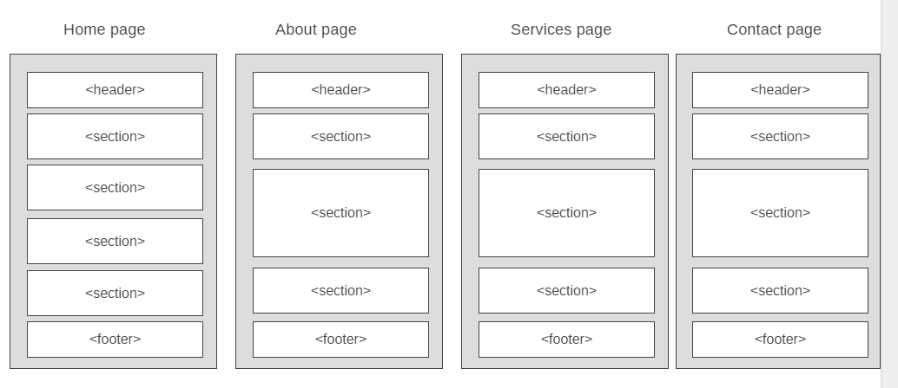

# Development Strategy

> `App-theme`

Beginner friendly front-end project with a responsive HTML5 and CSS3 website template.  
It uses FlexboxGrid which is a lightweight Flexbox based grid system to align the elements easily and uses the same classes as the Bootstrap grid.

## Wireframe

<!-- include a wireframe for your project in this repository, and display it here -->
<!-- wireframe.cc is a good site for getting started with wireframes -->

## 0. Set-Up

__A User can see my initial repository and live demo__

### Repo

- Generate from Template
- Write initial, basic README
- Turn on GitHub Pages

## 1. header

__As a visitor I want to see the title of the page__

### Repo

This user story was developed locally on a brach called `header`

### HTML

* header element with an id, holding:
  * heading with an inline class
  * nav with and an id
* nav list element with a class
* row and col class
* footer element with an id class

### CSS

* styling of the page body (body)
* styling for the container class (.container)
* styling for the header id (#main-header)
* styling for the heading inline class (.primary-text)
* styling for the nav id (#navbar)
* styling for the nav list items (#navbar li) and class (#navbar li.current a)
* styling for the nav links (#navbar a)
* styling for the links pseudo class (#navbar a:hover)
* styling for the background class (.primary-background)
* styling for the images (img)
* footer styling  (#main-footer)

## 2. company showcase

__As a visitor I want to see what the company represents__

### Repo

This user story was developed locally on a brach called `showcase`

### HTML

* Section element with an id, holding:
  * the heading with an inline class
  * paragraph
* row and col class

### CSS

* styling for the section id (#showcase)
* section heading styling
* section paragraph styling
* styling of the heading and paragraph background class (#showcase .showcase-content)
* styling the heading and paragraph layout (#showcase .row)
* media queries for the heading and background class responsive layout

## 3.  product core features

__As a visitor I want to see what the company product core features are__

### Repo

This user story was developed locally on a brach called `features`

### HTML

* section element with an id, holding heading, paragraph, nested grid
* row and col class for the section
* row and col class for the nested grid elements
* nested grid holding image element with fa-class, heading and paragraph element

### CSS

* section heading styling (#features h2)
* section paragraph styling (#features p)
* image element styling (#features .fa)

## 4. company and product summary

__As a visitor I want to see what the company and it's product info__

### Repo

This user story was developed locally on a brach called `info`

### HTML

* section elements with id's
* row and col classes for the sections
* image element
* list heading
* list with image element with fa-class
* paragraph
* form for subscription

### CSS

* styling for the section id's (#info)
* section headings styling
* section lists layout styling
* list items layout styling
* the styling of the form input and button

## 5.  company and it's services

__As a visitor I want to read detailed information about the company and it's services__

### Repo

This user story was developed locally on a brach called `about`

### about.html

* create the file
* add the index file template
* change the page title
* update the nav list item with the current  class
* remove excessive sections
* personalise the page content

### services.html

* create the file
* add the about file template
* change the page title
* update the nav list item with the current  class
* personalise the page content

### HTML

* section element with id for subheading
* section element with id for inner pages and class for main text
* heading with an inline class
* section element with id for inner pages and class for services
* list with headings and paragraphs for services
* row and col classes for these sections

### CSS

* styling of inner pages section id's (#page)
* list items layout styling (.services ul li)
* list items odd styling (.services ul li:nth-child(odd))
* list items even styling (.services ul li:nth-child(even))

## 6.  __

__full user story description__

### Repo

what branch(es) did you work on?

### HTML

what did you change in the HTML and why?

### CSS

what did you change in the CSS and why?

## 7.  __

__full user story description__

### Repo

what branch(es) did you work on?

### HTML

what did you change in the HTML and why?

### CSS

## Finishing Touches

what did you change in the CSS and why?

- Write final, complete README:
  - [makeareadme.com](https://www.makeareadme.com/)
  - [bulldogjob](https://bulldogjob.com/news/449-how-to-write-a-good-readme-for-your-github-project)
  - [meakaakka](https://medium.com/@meakaakka/a-beginners-guide-to-writing-a-kickass-readme-7ac01da88ab3)
- Validate code to check for any last mistakes
